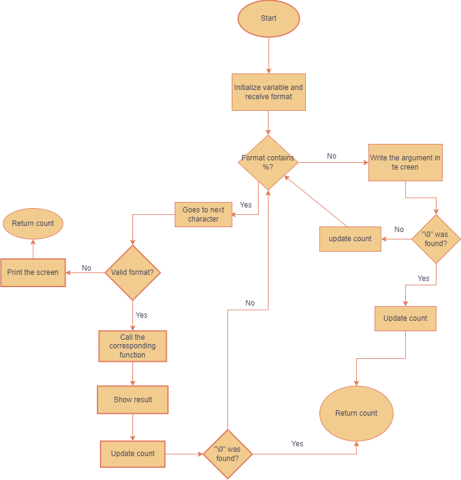

# _printf Project

This project implements a custom version of the `printf` function from the C standard library. The `_printf` function allows formatted strings to be printed using basic format specifiers.

---

## **Documentation of the Topics Covered**

Our implementation includes:

- **Variadic Functions**:
  - Handling a variable number of arguments using `<stdarg.h>`.
  - Using the macros `va_start`, `va_arg`, and `va_end` to traverse the argument list.
  
- **Direct Write System**:
  - Writing output directly to the standard output (`stdout`) using the `write` system call.

- **Basic Format Handling**:
  - Support for format specifiers `%c`, `%s`, `%d`, `%i`, and `%%`.
  - Handling null strings, negative numbers, and integer limits (`INT_MIN`).

- **Modularization**:
  - Using helper functions to handle each format specifier.

---

## **Return Value**

The `_printf` function returns the total number of characters printed, excluding the null character (`\0`).

---

## **Flowchart**

The following flowchart illustrates the execution flow of the `_printf` function:

 

---

## **File Descriptions**

### **1. _printf.c**
Contains the main implementation of `_printf` and the following helper functions:
- **`aux_c`**: Handles the `%c` specifier.
- **`aux_s`**: Handles the `%s` specifier.
- **`aux_por`**: Handles the `%%` specifier.
- **`aux_id`**: Handles the `%i` and `%d` specifiers.

### **2. main.c**
Test file containing various cases to verify the correct functionality of `_printf` compared to `printf`.

### **3. main.h**
Header file declaring the functions used in the project, specifically `_printf`.

---

## **Created Specifiers**

Our implementation supports the following specifiers:

- **`%c`**: Prints a single character.
- **`%s`**: Prints a string of characters.
- **`%d` / `%i`**: Prints an integer (supports both positive and negative numbers).
- **`%%`**: Prints a percentage sign.

---

## **Test Cases**
```c
#include "main.h"
#include <stdio.h>

int main(void)
{
    _printf("Character: %c\n", 'A');
    _printf("String: %s\n", "Hello world");
    _printf("Positive number: %d\n", 123);
    _printf("Negative number: %d\n", -456);
    _printf("Percentage: %%\n");
    _printf("Null string: %s\n", NULL);
    _printf("Text without specifiers.\n");

    return (0);
}
